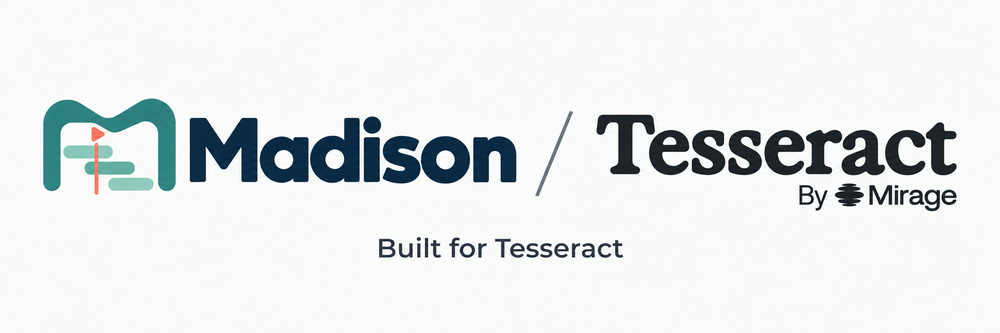
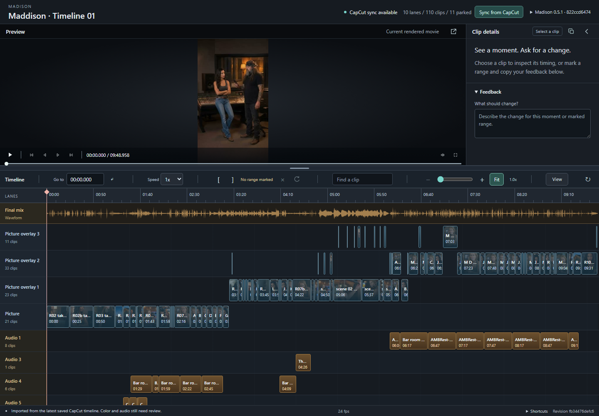

# Madison



**Review your Tesseract edit in a browser.**

Your AI agent edits the video in [Tesseract](https://github.com/mirage-hq/Tesseract), built by [Mirage](https://mirage.app/tesseract). Madison lets you watch the result, inspect the timeline and make simple clip changes yourself.

## Start with your project

Copy this into a coding agent that can work on your computer:

```text
Help me set up Tesseract and Madison on my computer.

Get Madison from https://github.com/broadsidecode/madison
and follow its START-HERE.md setup guide.

Connect my existing Tesseract project. If I do not have one,
ask which footage I want to edit and help me start a project.
Check the tools I already have and explain any installation
or terms that need my decision.

Keep my files local and preserve the originals. Open my project
in Madison, show me how to review it, and tell me how to reopen
it later. Only use the optional CapCut connection if I ask.
```

Your agent will check whether your computer can run Tesseract and guide you through setup.

## Review your edit

Watch the movie beside its picture and audio lanes. Zoom, scrub, mark a section and copy precise feedback for your agent. Pop the preview into another window when you want more room. When Madison is connected to an editable Tesseract project, you can remove, trim or mute simple clips and apply those changes to a new project version.



Your agent can handle larger revisions and render the final movie after your review.

## CapCut is optional

If you edit in CapCut, your local agent can connect a saved project. Madison then shows a preview of changes before you choose to import them into Tesseract. This connection is experimental: effects and audio may need attention, so check the result before delivery.

## More information

Read the [setup guide](START-HERE.md), [review controls](docs/viewer-controls.md), [simple editing guide](docs/editing.md) or [CapCut connection guide](docs/experimental-importer.md). Your agent can use the [manual setup](docs/manual-setup.md), [technical details](docs/manifest.md) and [verification notes](docs/verification.md).

Madison is free under the [MIT license](LICENSE) and is an independent community project. [Tesseract has its own terms](https://github.com/mirage-hq/Tesseract/blob/main/TERMS.md). Your AI agent's normal usage costs may still apply.
