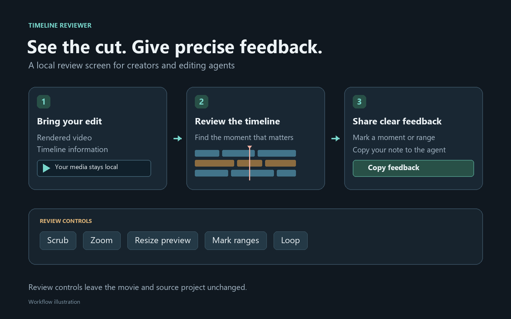

# Set up Timeline Reviewer with Codex



Open your downloaded or cloned repository folder in Codex, then paste the prompt below. It asks Codex to use the instructions and commands shipped with your version.

## Copy this setup prompt

```text
Set up Timeline Reviewer from the repository currently open in this task.

Read AGENTS.md, README.md, and the relevant setup documentation first. Inspect the actual entry points and command help when needed. Follow this checkout's instructions rather than guessing commands or using instructions from another version.

Check my operating system and required local tools. Set up only the dependencies needed for the standalone viewer. Do not require Tesseract for basic viewing. Keep any virtual environment and generated demo or review files local to this checkout or a clearly named new output folder. Preserve existing files.

Start with the bundled synthetic demo. Launch the viewer on an available IPv4 loopback address, bound to 127.0.0.1, and give me the full local URL. Do not stop an unrelated service to obtain a port or expose the viewer to the network.

Verify that the timeline and video load. Exercise playback, seeking, zoom, the resizable divider, range marking, looping, and copied feedback. If browser inspection is available, inspect the rendered page. If it is unavailable, state that limitation and give me a short manual check instead of claiming those checks passed.

Leave the experimental CapCut to Tesseract importer disabled unless I ask to use it. If I do, read its documentation, check the separately installed tools and supported versions, inspect the selected saved timeline, and explain unsupported features before proceeding. Import into a new destination. Never alter the source CapCut project, enable a lossy conversion without my agreement, or imply that editable transfers work in both directions.

Use only the demo and files I explicitly provide. Do not upload my media, publish anything, or commit generated review bundles.

Finish with the viewer URL, how to start and stop it next time, what you verified, and any remaining limitations. Then ask which video or review bundle I want to open.
```

## What to expect

The viewer is a local review screen for a rendered movie and its timeline information. It helps you point an editing agent to a clip, moment, or marked range. Its review controls do not edit the movie or your source project.

The image above is a workflow illustration using neutral graphics, not a screenshot of a private production project.
